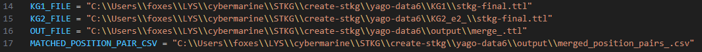

## 사용법

1. conda 가상환경 생성 및 실행 
    
    conda create -n yago-stkg python=3.11
    
    conda activate yago-stkg

2. 의존성 설치
    
    pip install -r requirements.txt

3. 사전 입력 데이터 준비

    /input-data/ 경로에 stkg로 생성할 로우 데이터(csv) 파일 삽입

    /input-data/stkg/ 경로에 사전 정의된 schema.ttl, taxonomy.ttl 파일 삽입

4. KG 생성 방법

    make.bat파일에서
    
    
    
    입력 csv 파일과 결과 출력 폴더 설정

    명령어 : make.bat

5. KG 병합 방법

    KG 생성 때 저장한 출력 폴더의 final-stkg.ttl 파일의 경로를 merge_test_8.py의 아래 사진과 같은 경로에 삽입

    이 때, 병합 KG 출력 경로와 seed 매칭 쌍을 저장할 경로도 함께 지정

    

    명령어 : python merge_test_8.py

6. 결과

    https://www.notion.so/325de7c5378c80c6be0ac643f5f00576?source=copy_link#329de7c5378c80bfb31cf35c49245fd5

    위 노션 페이지 참고

7. 결과 파일
    - ver1.0 : yago-data5
    - ver2.2 : yago-data6
    - ver2.4 : yago-data7
    - ver3.0 : yago-data8
    - ver3.1 : yago-data9
    - ver3.2 : yago-data10
    
    https://www.notion.so/325de7c5378c80c6be0ac643f5f00576?v=2e6de7c5378c81c196ce000cb28c91e5&source=copy_link#329de7c5378c8000a276d4e34e3cda66

    csv 버전 별 특징 : 위 노션 페이지 참고