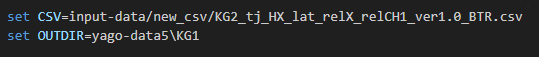

## 사용법

1. conda 가상환경 생성 및 실행 
    
    conda create -n yago-stkg python=3.11
    
    conda activate yago-stkg

2. 의존성 설치
    
    pip install -r requirements.txt

3. 사전 입력 데이터 준비

    /input-data/ 경로에 stkg로 생성할 로우 데이터(csv) 파일 삽입

    /input-data/stkg/ 경로에 사전 정의된 schema.ttl, taxonomy.ttl 파일 삽입

4. KG 생성 방법

    make.bat파일에서
    
    
    
    입력 csv 파일과 결과 출력 폴더 설정

    명령어 : make.bat